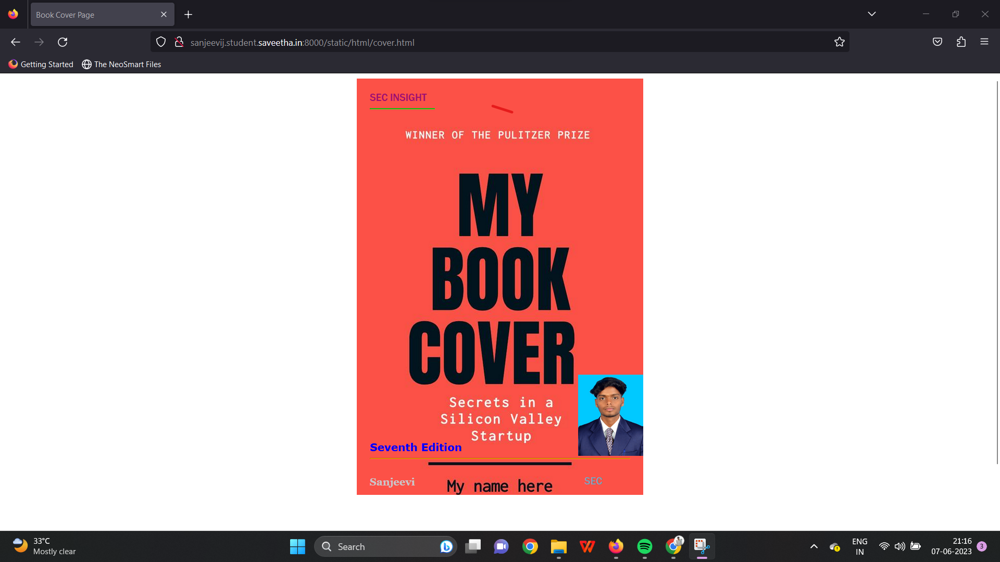
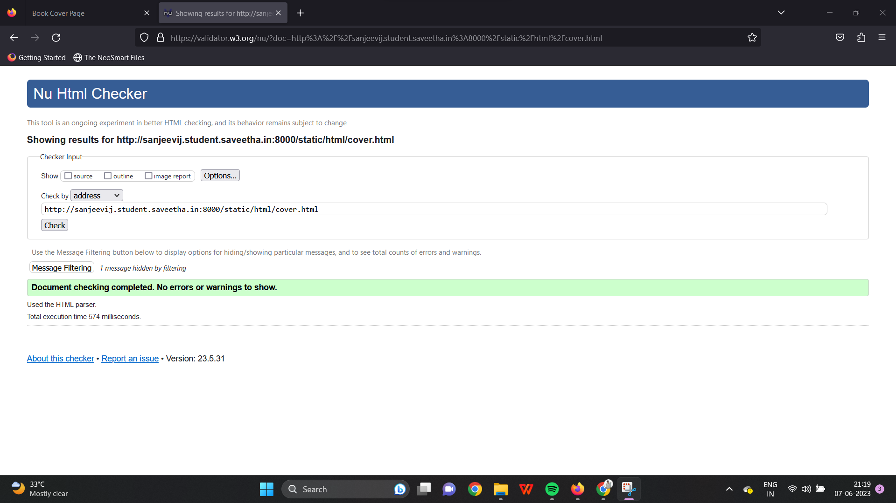

# Ex.06 Book Front Cover Page Design
## AIM:
To design a book front cover page using HTML and CSS.

## DESIGN STEPS:

### Step 1:
Clone the GitHub repository.

### Step 2:
Create a Django Admin interface.

### Step 3:
Write the HTML code with relevant CSS properties.

### Step 4:
Choose the appropriate style and color scheme.

### Step 5:
Validate the HTML code.

### Step 6:
Publish the website in the given URL.

## PROGRAM:
```
<!DOCTYPE html>
<html lang="en">
    <head>
         <meta name="viewport" 
         content="width=device-width, initial-scale=1.0">
         <style>

        .bookpage{
            width: 400px;
            height: 600px;
            color:rgb(119, 160, 187);
            margin-left: auto;
            margin-right: auto;
            padding: 20px;
            font-family: 'Franklin Gothic Medium', 'Arial Narrow', Arial, sans-serif;
            background-image: url(/static/images/back.jpg);
            background-size: cover;
        }
            

        .insight{
            color: rgb(158, 15, 115);

        }

        
        .hrstyle{
            width:100px;
        }
        .author{
            color: white;
            display: inline;
            position: relative;
            color: rgb(202, 197, 201);
            top:190px;
            
            font-family:Georgia;
            font-size: medium;
        }
        .booktitle{
            font-family: 'Courier New', Courier, monospace;
            font-size: larger;
            text-align: center;
            position: relative;
            top: 30px;
        
        }
        .id {
            width:400px;
            position: relative;
            top:180px;
            
        }
        .pub{
            font-size: medium;
            position: relative;
            top:155px;
            left:330px;
        }
        .ed{
            color:blue;
            font-size: medium;
            font-family: Verdana;
            position:relative;
            top:85px;

        }
        .subtitle{
            font-family:Tahoma;
            font-size: large;
            position: relative;
            top:40px;
        }
        .mypic{
            position: relative;
            top: 400px;
            left: 320px;
            width: 100px;
            height: 340px;
            background-size: cover;
        }
        </style>
        <title>Book Cover Page</title>
    </head>
    <body>
        <div class="bookpage">
            <div class="insight">
                SEC INSIGHT
            </div>
            <div class="hrstyle">
                <hr style="color: rgb(0, 255, 13);">
                
            </div>
            <div class="mypic">
                
            </div>
            <div class="id">
                <hr style="color: orange;">
            </div>
            <div class="author">
               <p><b>Sanjeevi</b></p>
            </div>
            <div class="pub">
                SEC
            </div>
            <div class="ed">
                <b>Seventh Edition</b>
            </div>
            
        </div>
    </body>
</html>
```

## OUTPUT:


## HTML VALIDATOR:


## RESULT:
The program for designing book front cover page using HTML and CSS is completed successfully.
